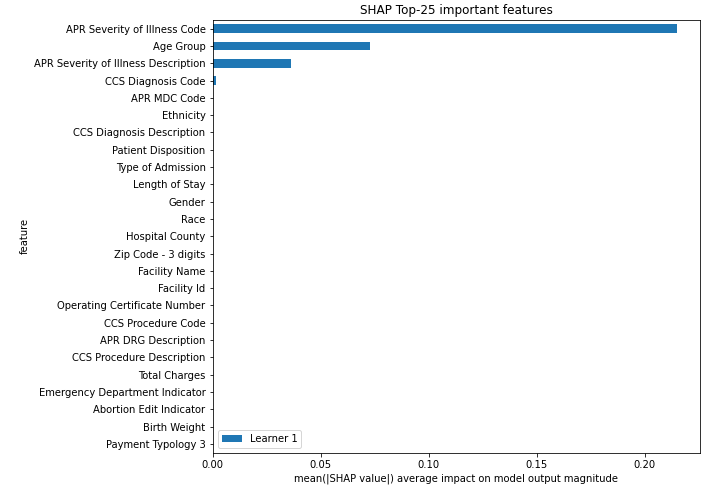

# Summary of 2_DecisionTree

[<< Go back](../README.md)

## Decision Tree
- **n_jobs**: -1
- **criterion**: gini
- **max_depth**: 3
- **explain_level**: 2

## Validation
 - **validation_type**: split
 - **train_ratio**: 0.75
 - **shuffle**: True
 - **stratify**: True

## Optimized metric
logloss

## Training time

10.7 seconds

## Metric details
|           |    score |   threshold |
|:----------|---------:|------------:|
| logloss   | 0.218947 | nan         |
| auc       | 0.945282 | nan         |
| f1        | 0.944106 |   0.518876  |
| accuracy  | 0.908639 |   0.518876  |
| precision | 0.99449  |   0.984508  |
| recall    | 1        |   0.0392308 |
| mcc       | 0.697582 |   0.518876  |

## Metric details with threshold from accuracy metric
|           |    score |   threshold |
|:----------|---------:|------------:|
| logloss   | 0.218947 |  nan        |
| auc       | 0.945282 |  nan        |
| f1        | 0.944106 |    0.518876 |
| accuracy  | 0.908639 |    0.518876 |
| precision | 0.928183 |    0.518876 |
| recall    | 0.960586 |    0.518876 |
| mcc       | 0.697582 |    0.518876 |

## Confusion matrix (at threshold=0.518876)
|                  |   Predicted as Major |   Predicted as Minor |
|:-----------------|---------------------:|---------------------:|
| Labeled as Major |                  606 |                  264 |
| Labeled as Minor |                  140 |                 3412 |

## Learning curves

## Decision Tree 

### Tree #1

### Rules

if (APR Severity of Illness Code <= 2.5) and (Age Group <= 3.5) and (APR MDC Code > 0.5) then class: Minor (proba: 99.42%) | based on 7,536 samples

if (APR Severity of Illness Code > 2.5) and (APR Severity of Illness Description > 0.5) and (Age Group <= 3.5) then class: Minor (proba: 66.39%) | based on 1,693 samples

if (APR Severity of Illness Code <= 2.5) and (Age Group > 3.5) and (APR Severity of Illness Code > 1.5) then class: Minor (proba: 82.97%) | based on 1,374 samples

if (APR Severity of Illness Code > 2.5) and (APR Severity of Illness Description > 0.5) and (Age Group > 3.5) then class: Major (proba: 73.79%) | based on 1,339 samples

if (APR Severity of Illness Code > 2.5) and (APR Severity of Illness Description <= 0.5) and (CCS Diagnosis Code <= 253.5) then class: Major (proba: 95.64%) | based on 780 samples

if (APR Severity of Illness Code <= 2.5) and (Age Group > 3.5) and (APR Severity of Illness Code <= 1.5) then class: Minor (proba: 97.49%) | based on 517 samples

if (APR Severity of Illness Code > 2.5) and (APR Severity of Illness Description <= 0.5) and (CCS Diagnosis Code > 253.5) then class: Major (proba: 64.0%) | based on 25 samples

if (APR Severity of Illness Code <= 2.5) and (Age Group <= 3.5) and (APR MDC Code <= 0.5) then class: Major (proba: 100.0%) | based on 1 samples

## Permutation-based Importance

## Confusion Matrix

## Normalized Confusion Matrix

## ROC Curve

## Kolmogorov-Smirnov Statistic

## Precision-Recall Curve

## Calibration Curve

## Cumulative Gains Curve

## Lift Curve

## SHAP Importance

## SHAP Dependence plots

### Dependence (Fold 1)

## SHAP Decision plots

### Top-10 Worst decisions for class 0 (Fold 1)

### Top-10 Best decisions for class 0 (Fold 1)

### Top-10 Worst decisions for class 1 (Fold 1)

### Top-10 Best decisions for class 1 (Fold 1)

[<< Go back](../README.md)
