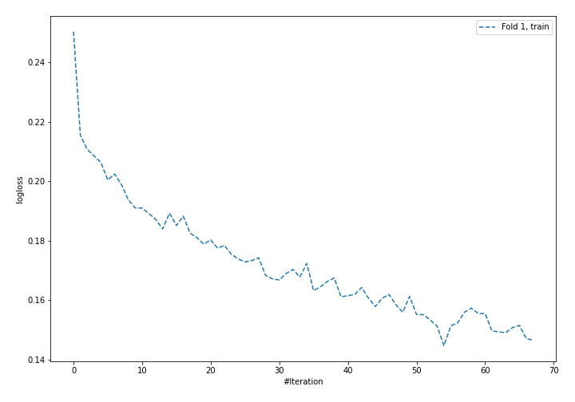
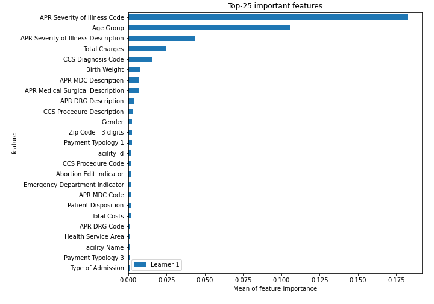
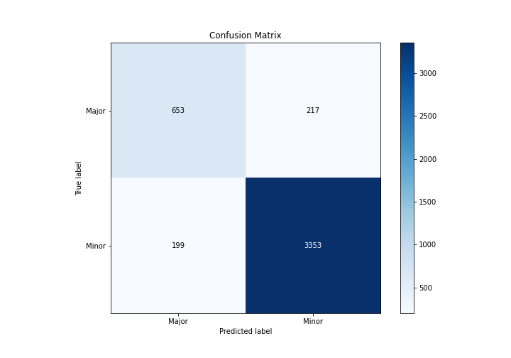
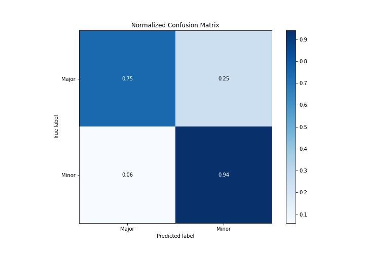
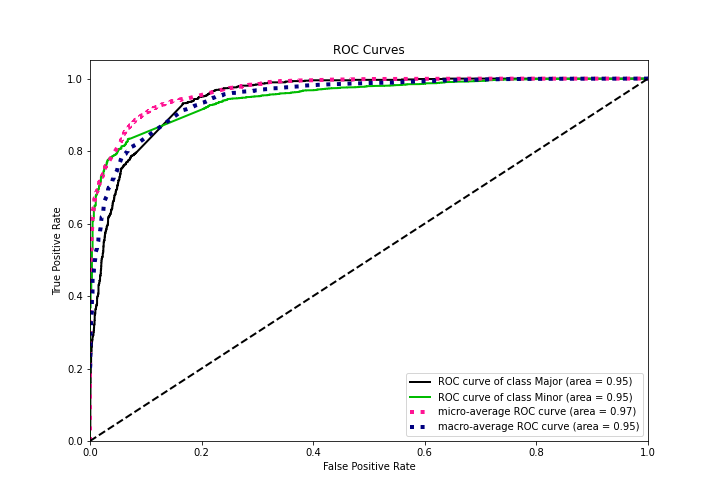
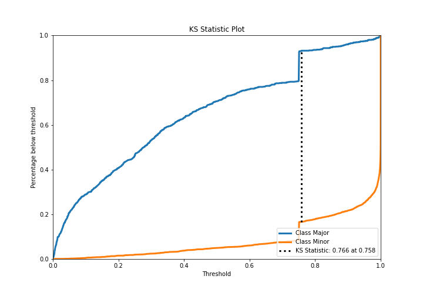
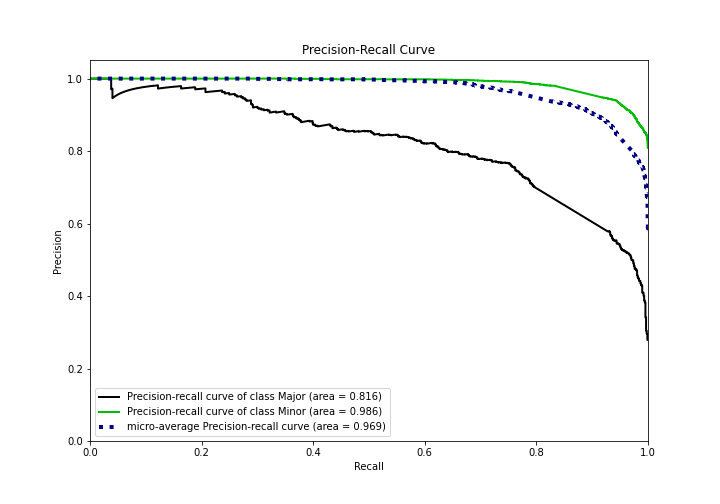
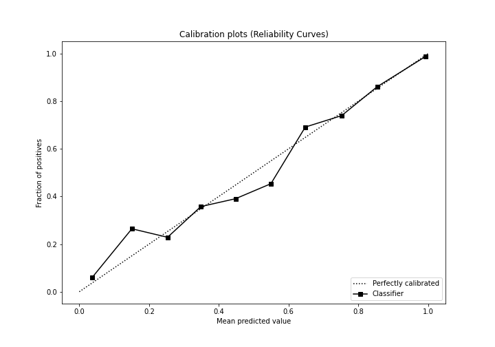
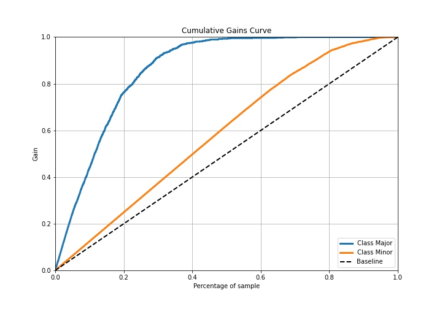
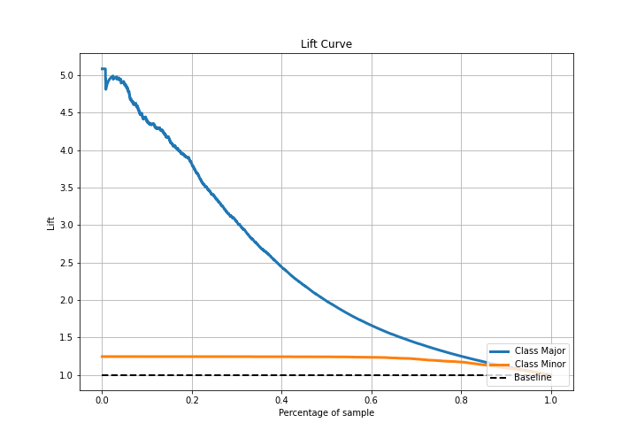

# Summary of 4_Default_NeuralNetwork

[<< Go back](../README.md)

## Neural Network
- **n_jobs**: -1
- **dense_1_size**: 32
- **dense_2_size**: 16
- **learning_rate**: 0.05
- **explain_level**: 2

## Validation
 - **validation_type**: split
 - **train_ratio**: 0.75
 - **shuffle**: True
 - **stratify**: True

## Optimized metric
logloss

## Training time

11.7 seconds

## Metric details
|           |    score |     threshold |
|:----------|---------:|--------------:|
| logloss   | 0.22617  | nan           |
| auc       | 0.949591 | nan           |
| f1        | 0.941589 |   0.574694    |
| accuracy  | 0.905925 |   0.574694    |
| precision | 1        |   0.999991    |
| recall    | 1        |   3.97683e-06 |
| mcc       | 0.700077 |   0.574694    |

## Metric details with threshold from accuracy metric
|           |    score |   threshold |
|:----------|---------:|------------:|
| logloss   | 0.22617  |  nan        |
| auc       | 0.949591 |  nan        |
| f1        | 0.941589 |    0.574694 |
| accuracy  | 0.905925 |    0.574694 |
| precision | 0.939216 |    0.574694 |
| recall    | 0.943975 |    0.574694 |
| mcc       | 0.700077 |    0.574694 |

## Confusion matrix (at threshold=0.574694)
|                  |   Predicted as Major |   Predicted as Minor |
|:-----------------|---------------------:|---------------------:|
| Labeled as Major |                  653 |                  217 |
| Labeled as Minor |                  199 |                 3353 |

## Learning curves

## Permutation-based Importance

## Confusion Matrix

## Normalized Confusion Matrix

## ROC Curve

## Kolmogorov-Smirnov Statistic

## Precision-Recall Curve

## Calibration Curve

## Cumulative Gains Curve

## Lift Curve

[<< Go back](../README.md)
