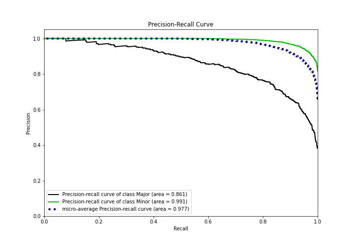

# Summary of Ensemble

[<< Go back](../README.md)

## Ensemble structure
| Model                   |   Weight |
|:------------------------|---------:|
| 3_Default_Xgboost       |        3 |
| 4_Default_NeuralNetwork |        1 |
| 5_Default_RandomForest  |        1 |

## Metric details
|           |    score |    threshold |
|:----------|---------:|-------------:|
| logloss   | 0.197531 | nan          |
| auc       | 0.961377 | nan          |
| f1        | 0.945995 |   0.510743   |
| accuracy  | 0.912935 |   0.514193   |
| precision | 1        |   0.991164   |
| recall    | 1        |   0.00598748 |
| mcc       | 0.734224 |   0.593923   |

## Metric details with threshold from accuracy metric
|           |    score |   threshold |
|:----------|---------:|------------:|
| logloss   | 0.197531 |  nan        |
| auc       | 0.961377 |  nan        |
| f1        | 0.945965 |    0.514193 |
| accuracy  | 0.912935 |    0.514193 |
| precision | 0.943185 |    0.514193 |
| recall    | 0.948761 |    0.514193 |
| mcc       | 0.722091 |    0.514193 |

## Confusion matrix (at threshold=0.514193)
|                  |   Predicted as Major |   Predicted as Minor |
|:-----------------|---------------------:|---------------------:|
| Labeled as Major |                  667 |                  203 |
| Labeled as Minor |                  182 |                 3370 |

## Learning curves

## Confusion Matrix

## Normalized Confusion Matrix

## ROC Curve

## Kolmogorov-Smirnov Statistic

## Precision-Recall Curve

## Calibration Curve

## Cumulative Gains Curve

## Lift Curve

[<< Go back](../README.md)
